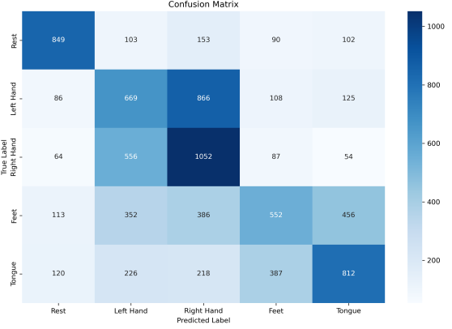

# EEG Classification - Experments, Models Exploration, and Advancements in Deep Learning CNN for EEG

## Table of Contents
- [1. Data Processing Rationale and Workflow](#1-data-processing-rationale-and-workflow)
  - [1.1 Dataset Overview and Challenges](#11-dataset-overview)
  - [1.2 Experiments and Data Processing Selection](#12-experiments-and-data-processing-selection)

- [2. Models & Evaluations (From Worst to Best)](#2-models--evaluations)
  - [2.0 Simple Classifiers](#20-simple-classifiers)
    - [2.0.1 Naive Bayes](#201-naive-bayes)
    - [2.0.2 Support Vector Machine (SVM)](#202-support-vector-machine-svm)
    - [2.0.3 Random Forest](#203-random-forest)
  - [2.1 *Key Part*: Model Architectures for LSTM and normal + deeper learning CNNs](#21-model-architectures)
    - [2.1.0 LSTM](#210-lstm)
    - [2.1.1 Basic CNN with ReLU](#211-basic-cnn-with-relu)
    - [2.1.2 Basic CNN with ELU](#212-basic-cnn-with-elu)
    - [2.1.3 Deep CNN](#213-deep-cnn)
  - [2.2 Training Process](#22-training-process)

- [3. How to Read and Use our Repository](#3-how-to-read-and-use-our-repository)
  - [3.1 Repository Structure](#31-repository-structure)
  - [3.2 Installation Guide](#32-installation-guide)
  - [3.3 Usage Instructions](#33-usage-instructions)
  - [3.4 Results Visualization](#34-results-visualization)

- [4. Data Work Flow and Appendix](#4-reference-and-appendix)

## 1. Data Processing Rationale and Workflow
Due to the size and complexity of the problem, we will focus on the (BCI Competition IV Dataset 2a)(https://archive.ics.uci.edu/dataset/533/eeg+database) Subject 1's data for this project.
As a result of careful experiments, we choose to use 5-fold cross-validation with no normalization in preprocessing (we did normalization in complex models), bandpass 8 - 50Hz, window size 100, and window overlap 90.

### 1.1 Dataset Overview and Challenges

#### Overview [The Work Flow about How We Determine Our Data Processing Can Be Found at the end of the README](#4-reference-and-appendix)
The BCI Competition IV Dataset 2a contains EEG recordings from 9 subjects performing motor imagery tasks. Our analysis focuses on Subject 1's data:
- 22 EEG channels
- 5 motor imagery classes: Rest(0), Left Hand(1), Right Hand(2), Feet(3), Tongue(4)
- ~480,000 EEG samples after preprocessing
- Data windowing: 100 samples/window with 90-sample overlap
<div align="center">
  
  
</div>

#### Key Challenges
1. **Signal Quality**:
   - High noise-to-signal ratio in EEG recordings
   - Susceptibility to motion artifacts and electrical interference

2. **Temporal Dependencies**:
   - Complex temporal patterns in brain signals
   - Window overlap creates potential data leakage

3. **Class Slight Imbalance**:
   - Rest state (Class 0) underrepresented
   - Potential bias in model training

4. **Inter-trial Variability**:
   - Mental states vary between recordings
   - Inconsistent signal patterns for same motor imagery tasks

### 1.2 Experiments and Data Processing Selections
#### Discussion: Rationale for Choices
These choices were made based on experimental results and represent an optimal balance between model performance and computational efficiency.
(*Note: if interested please see Experimental Results folder)

1. **5-fold Cross-validation**:
   - Provides robust model evaluation
   - Balances between computational cost and validation reliability
   - Helps detect and prevent overfitting

2. **Window Size and Overlap**:
   - Window Size (100): Captures sufficient temporal patterns
   - Overlap (90%): 
     - Significantly improves classification accuracy (~10% increase)
     - Enables faster real-time predictions
     - Provides more training samples while preserving temporal continuity
   - Models showed poor performance without overlap due to missed temporal transitions

3. **Bandpass Filter (8-50Hz)**:
   - Removes low-frequency artifacts
   - Retains relevant motor imagery frequencies
   - Eliminates high-frequency noise

4. **No Initial Normalization**:
   - Preserves original signal characteristics
   - Normalization performed within model architectures
   - Allows models to learn from raw signal patterns

## 2. Models & Evaluations (From Worst to Best)
We improve our models from simple classifiers to deep learning CNNs. **Naive Bayes, SVM, and Random Forest => LSTM and CNN-ELU, CNN-ReLU => Deep CNN.**

### 2.0 Simple Classifiers
Reason for using simple classifiers: Before implementing deep learning models, we established baselines using traditional machine learning approaches. Each classifier was evaluated using 5-fold cross-validation with standardized features get from A01_100_90_flattened.parquet in dataset_bci_iv_2a/

Key findings from baseline models:
1. Traditional classifiers struggle with the full 5-class problem
2. Performance improves significantly for binary classification tasks
3. SVM and Random Forest outperform Naive Bayes in terms of accuracy and F1-score

#### 2.0.1 Naive Bayes
- **Architecture**: Gaussian Naive Bayes classifier assuming feature independence with 5-fold cross-validation
- **Performance**:
  - Average Accuracy: 32.24%
  - Average Precision: 31.35%
  - Average F1-Score: 0.31
- **Limitations**: Poor performance due to invalid independence assumption between EEG channels 

<div align="center">
  
  
  <br>
  <em>Left: Training metrics showing high variance
  Right: Confusion matrix revealing poor class discrimination</em>
</div>

#### 2.0.2 Support Vector Machine (SVM)
- **Architecture**: RBF kernel SVM with scaled features with 5-fold cross-validation
- **Hyperparameters**:
  - Kernel: RBF (captures non-linear relationships)
  - C: 1.0 (regularization)
  - Gamma: 'scale' (kernel coefficient)
- **Performance**:
  - Average Accuracy: 45.78%
  - Average Precision: 48.11%
  - Average F1-Score: 0.47
  - More stable between folds compare to Naive Bayes
- **Advantages**: 
  -Better handles non-linear relationships in EEG data (94% in Single Channel Experiments)
 - Best performing traditional classifier

<div align="center">
  
  
  <br>
  <em>Left: Training curves with improved stability over Naive Bayes
  Right: Confusion matrix showing better class separation, especially for Rest state</em>
</div>

#### 2.0.3 Random Forest
- **Architecture**: Ensemble of 100 decision trees
- **Hyperparameters**:
  - n_estimators: 100
  - max_features: 'auto'
  - bootstrap: True
- **Performance**:
  - Average Accuracy: 71.2%
  - Macro F1-Score: 0.70
  - Most stable (std: 0.05)
- **Advantages**: 
  - Captures some complex feature interactions
  - Best performing traditional classifier when balancing training time and performance

<div align="center">
  
  
  <br>
  <em>Left: Training metrics demonstrating consistent performance
  Right: Confusion matrix showing slightly better discrimination between most classes than Naive Bayes</em>
</div>

### 2.1  *Key Part*: Model Architectures for LSTM and normal + deeper learning CNNs
Bidirectional LSTM and CNN-ELU, CNN-ReLU are our first few simpler models with the CNN-ReLU the better performing one. Then we get inspired from papers to train a customized Deep CNN that outperforms all the previous models dramatically!

**For Bonus, we used Adam and AdamW and momentum parameters tuning to avoid getting stuck in local minima. We chose them due to Faster convergence than SGD, Less sensitive to hyperparameter choices, and Better handling of sparse gradients in temporal data like EEG**


#### 2.1.0 LSTM
- **Architecture**:
```
Input (batch_size, window_size, 22 channels)
       ↓
Bidirectional LSTM (input_size=22, hidden_size=128)
       ↓
Flatten
       ↓
ReLU
       ↓
Dropout (0.5)
       ↓
Linear (LazyLinear→1000) + Sigmoid
       ↓
Linear (1000→200) + Sigmoid
       ↓
Linear (200→5) + Sigmoid
```
- **Design Rationale**:
  - Optimizer: Adam to avoid getting stuck in local minima and for EEG data
  - Bidirectional LSTM to capture temporal dependencies in both directions
  - Large initial dense layer (1000) to learn complex feature combinations
  - Aggressive dropout (0.5) to prevent overfitting
- **Performance**:
  - Accuracy: 64.2%
  - High computational cost(Memory and Time and big model size)
  - Slower convergence than CNNs

<div align="center">
  
  
  <br>
  <em>Left: Training curves showing gradual convergence
  Right: Confusion matrix indicating moderate class separation: Very poor ability to classify "Tongue" class</em>
</div>


#### 2.1.1 Basic CNN with ReLU
- **Architecture**:
```
Input (batch_size, 1, 22 channels, window_size)
       ↓
Conv2D (1→8, kernel=(22,1)) + BatchNorm + ReLU
       ↓
Conv2D (8→40, kernel=(1,30)) + BatchNorm + ReLU
       ↓
Flatten
       ↓
Dropout (0.2)
       ↓
Linear (LazyLinear→400) + ReLU
       ↓
Dropout (0.3)
       ↓
Linear (400→200) + ReLU
       ↓
Linear (200→5)
```
  
- **Design Choices**:
  - First conv layer: spatial filtering across channels
  - Second conv layer: temporal filtering
  - BatchNorm for stable training
  - Moderate dropout (0.2, 0.3) for regularization (We got overfitting when dropout is too high)
- **Hyperparameter Tuning**:
  - Optimizer: Adam 
  - Learning rate: 0.001 with ReduceLROnPlateau
  - Batch size: 16 (best balance of speed/memory)
  - Weight decay: 0.00005 for regularization
- **Performance**:
  - Best Fold(fold 2) Validation Accuracy: 73.55%
  - Best Fold Training Accuracy: 71.92%
  - Best Fold Precision: 0.74
  - Best Fold F1-Score: 0.74 
  - Final Loss: 0.6684

#### 2.1.2 Basic CNN with ELU
- **Architecture**: Identical to ReLU version but with ELU activation (ELU recommended by papers)
- **Key Differences**:
  - ELU activation for better gradient flow
  - Self-normalizing properties reduce need for BatchNorm
  - Smoother decision boundaries
- **Hyperparameter Tuning**:
  - Same configuration as ReLU version
  - Early stopping patience: 7 epochs
  - Learning rate scheduling: factor=0.1, patience=3
- **Performance**:
  - Best Fold (Fold 1)Validation Accuracy: 66.51%
  - Best Fold Training Accuracy: 68.3%
  - Best Fold Precision: 0.68
  - Best Fold F1-Score: 0.67
  - Final Loss: 0.8119

<div align="center">
  
  
  <br>
  <em>Left: Training metrics showing slightly faster convergence than LSTM
  Right: Confusion matrix demonstrating improved class discrimination</em>
</div>

#### 2.1.3 Deep CNN

 
Inspired by several key papers in EEG classification and deep learning, we developed an enhanced CNN architecture combining proven techniques from:
1. [Single-trial EEG classification of motor imagery using deep convolutional neural networks](https://www.sciencedirect.com/science/article/pii/S0030402616312980)
2. [EEGNet](https://arxiv.org/pdf/1611.08024)
3. [Deep Residual Learning for Image Recognition](https://arxiv.org/pdf/1512.03385)
4. [Squeeze-and-Excitation Networks](https://arxiv.org/pdf/1709.01507)

- **Architecture**:
```
Input Layer (batch_size, 1, 22, window_size)
    ↓
Spatial Attention
Conv1d(22→64) → BatchNorm → ELU → Conv1d(64→22) → Softmax
    ↓
Feature Extraction
Conv1d(22→64, kernel=31) → BatchNorm → ELU → Dropout(0.2)
    ↓
Residual Block 1 + SE-Block
Conv → BatchNorm → ELU → Conv → BatchNorm → SE-Block
    ↓
MaxPool(2) + Dropout(0.2)
    ↓
Residual Block 2 + SE-Block
Conv → BatchNorm → ELU → Conv → BatchNorm → SE-Block
    ↓
Channel Expansion Conv1d(64→128) 
    ↓
MaxPool(2) + Dropout(0.2)
    ↓
Global Average Pooling
    ↓
Classifier
Linear(128→64) → ELU → Dropout(0.5) → Linear(64→5)
```

- **Key Improvements**:
  - Spatial-temporal feature extraction
  - Channel attention mechanism
  - Residual connections for deeper training
  - Recalibration of channel attention with SE-Block
  - Label smoothing (0.1) for better generalization

- **Hyperparameter Optimization**: Tuned several times a compare trial can be found in the folder
  - Optimizer: AdamW (better weight decay handling than Adam)
  - Batch size: 32 with gradient accumulation (4 steps)
  - Learning rate: OneCycleLR (max_lr=0.001)
  - Weight decay: 0.01 with AdamW
  - Early stopping patience: 20 epochs
  - Gradient clipping: 0.5

- **Performance**:
  - Average 5-fold Accuracy: 92.06%
  - Best Fold (Fold 4)Validation Accuracy: 93.02%
  - Best Fold Training Accuracy: 91.31%
  - Best Fold Precision: 0.93
  - Best Fold F1-Score: 0.93
  - Final Best Validation Loss: 0.4073
  - Training time 14 hrs with cpu but really compact model size and high accuracy

<div align="center">
  
  
  <br>
  <em>Left: Training curves showing stable convergence
  Right: Confusion matrix demonstrating strong class separation</em>
</div>

### 2.2 Training Process
#### Training Strategy
- Progressive development from simple to complex models
- 5-fold cross-validation for all experiments
- Consistent data splits for fair comparison

#### Key Challenges & Solutions

1. **Overfitting**:
   - Challenge: Models quickly overfit due to EEG signal variability(especially in Experiments branch's CNN-v4)
   - Solutions:
     * Progressive dropout rates (0.2 → 0.5)
     * Label smoothing adjustment in Deep CNN
     * Early stopping with more patience

2. **Training Stability**:
   - Challenge: Unstable gradients and loss spikes
   - Solutions:
     * Gradient clipping at 0.5
     * Batch normalization
     * OneCycleLR scheduler for Deep CNN

3. **Resource Constraints**:
   - Challenge: Limited GPU availability
   - Solutions:
     * Gradient accumulation (4 steps)
     * Efficient batch sizes (16-32, reduce batch size when necessary)
     * Model checkpointing

#### Best Practices
- Regular validation monitoring
- Save best model states
- Track multiple metrics when training to detect overfitting/underfitting early(accuracy, F1, precision)
- Slightly balance sampling for class imbalance


## 3. How to Read and Use our Repository
You can find our code, models, and results easily according to directory names. (**except lstm which is too big and can only be inferenced as we can not upload to github**)

### 3.1 Repository Structure
Here is how to browse our repository:
**1. We have 1 directory for our dataset and its related preprocessing and 1 with the plotting for dataset EDA:**
```
.
├── dataset_bci_iv_2a/  # everything about dataset
├── Dataset_EDA/                                # Dataset analysis

```
**2. We have our directory with model's training and plotting codes, trained saved model in .pth (with relevant .npy for fold  histories if there are recorded), and our plotted fancy graphs for more details aside from report and slides. **
```
.
├── Best_DeepCNN_Better_Code+Model+Eval_Plots/  # Best performing model - the deeper learning CNN
├── CNN w ELU Code + Model + Eval Plots/        # Basic CNN with ELU as activation functions
├── CNN w ReLU Code + Model + Eval Plots/       # Basic CNN with ReLU as activation functions
├── LSTM_Code+Model+Eval_Plots/                 # LSTM (We use test and split finally due to its computation complexity)
├── Naive Bayes Code + Eval Plots/              # For Naive Bayes
├── Random Forest Code + Eval Plots/            # For Random Forest
├── SVM Code + Eval Results/                    # For SVM
└── ENV.yml                                     # Environment configuration
```
The other directory starting with "Z-" are unimportant as only for documentation facilitation.

3. We have some branches of our experiment and testing history for without overlaps and without k-fold cross validation which can be found in branch Experiments.

1. **Install Conda**
```bash
# Verify installation
conda --version  # Should show: conda 24.9.2

# Optional: Disable auto-activation
conda config --set auto_activate_base False
```

2. **Create Environment**
```bash
# Create and activate environment
conda env create -n eeg-classification --file ENV.yml
conda activate eeg-classification
```

3. **Install GNU Octave** (for .gdf file processing)
- Download from [GNU Octave website](https://octave.org/download)
- Install biosig package:
```octave
pkg install -forge biosig
pkg load biosig
```

### 3.3 Usage Instructions
1. **Data Processing**
```
# Generate processed dataset
cd dataset_bci_iv_2a
python dataset.py 1 100 90  # Creates A01_100_90.parquet
python dataset.py 1 100 90 --flatten # Creates A01_100_90_flattened.parquet
```

2. **Run Models**
```
# For Deep CNN as an instance
cd Best_DeepCNN_Better_Code+Model+Eval_Plots
python deepCNN_better.py
```
3. **View Results**
- Training plots will be saved in respective model directories
- Model checkpoints are saved as .pth files
- You can run respective plot.py to get the metrics plotted out
  

## 4. Reference and Appendix
1.Data Processing Decision Workflow:

